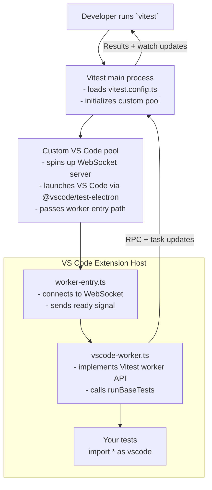

# vitest-environment-vscode

A Vitest pool that runs your test suites inside the real VS Code Extension Host.

> **Note:** The project name intentionally keeps the "environment" phrasing even though it ships a Vitest pool under the hood. The branding matches how folks search for VS Code testing tooling.

## Quick Start

### 1. Install the pool

```bash
npm install --save-dev vitest vitest-environment-vscode
# or
yarn add -D vitest vitest-environment-vscode
```

### 2. Configure Vitest to use VS Code

```ts
// vitest.config.ts
import { defineConfig } from 'vitest/config';
import { vsCodeWorker } from 'vitest-environment-vscode';

export default defineConfig({
	test: {
		pool: vsCodeWorker({
			reuseWorker: true,
			version: 'insiders', // or 'stable' / specific VS Code version tag
		}),
		include: ['src/**/*.test.ts'],
		server: {
			deps: {
				external: [/^vscode$/],
			},
		},
	},
});
```

`vsCodeWorker` accepts the same options exported from `vitest-environment-vscode/src/config.ts`:

- `version` (default `stable`) — choose which VS Code build `@vscode/test-electron` downloads. Accepts `stable`, `insiders`, or an explicit build tag like `1.95.0`. Pin this when you need reproducible editor behavior.
- `reuseWorker` (default `false`) — keep the Extension Host alive between test files. Enable for faster suites; disable when your tests assume a clean VS Code instance per file.

Tests now run against the real `vscode` API, so you can keep writing standard Vitest suites:

```ts
// src/extension.test.ts
import { describe, it, expect } from 'vitest';
import * as vscode from 'vscode';

describe('hello command', () => {
	it('executes inside VS Code', async () => {
		const result = await vscode.commands.executeCommand('my-extension.hello');
		expect(result).toBeUndefined();
	});
});
```

- Run `yarn vitest` (or `yarn test`) from your extension workspace to start the pool.
- Set `VITEST_ENV_VSCODE_DEBUG=1` to mirror pool logs in the terminal for troubleshooting.
- Be sure your Vitest `root` points at the extension you want to debug so the pool can load it via `@vscode/test-electron`.
- Mark the `vscode` module as external (as shown above) so bundlers don't try to package VS Code's runtime API—the Extension Host itself provides that module at runtime.

## How It Works



1. Vitest loads your config and hands work to the custom pool.
2. The pool creates a WebSocket server, launches VS Code through `@vscode/test-electron`, and points it at our worker entry script.
3. `worker-entry.ts` connects back, acknowledges readiness, and wires RPC transport.
4. `vscode-worker.ts` executes your specs via `runBaseTests`, streaming task updates over RPC so Vitest's reporters behave normally.
5. Because execution occurs inside the Extension Host, `import * as vscode from 'vscode'` resolves to the real API.

## Repository Layout

This repo is a monorepo that contains:

- **`packages/vitest-environment-vscode`** – the library itself.
- **`packages/dummy-extension`** – a sample VS Code extension used as a fixture in tests.
- **`packages/typescript-configs`** – shared tsconfig presets.

If you're hacking on the repo directly, the usual workspace scripts still apply:

```bash
# Install dependencies for every package
yarn install

# Development build/watch across packages
yarn build:watch

# One-off build
yarn build

# Repository test suites
yarn test     # (uses vitest)
yarn test:unit
yarn test:integration
```
