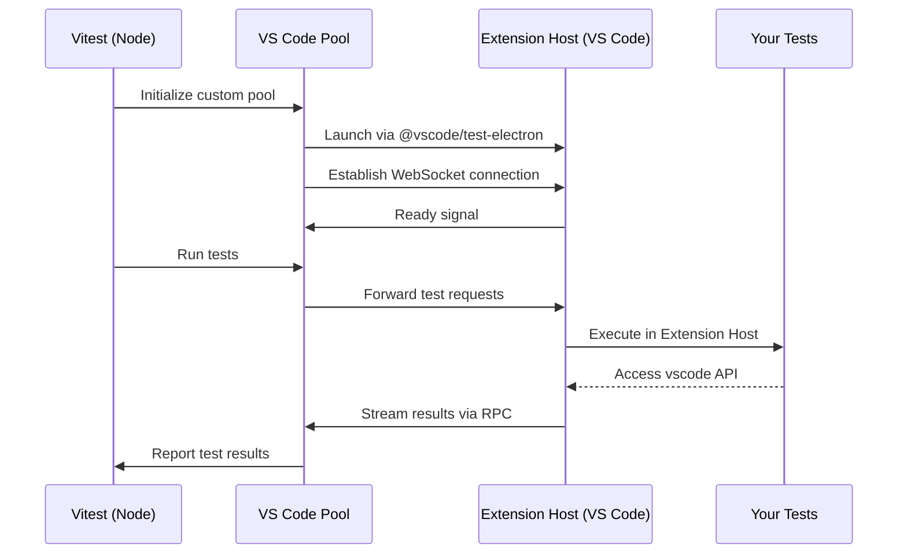

# vitest-environment-vscode

[](https://github.com/andrew-w-ross/vitest-enviroment-vscode/actions/workflows/ci.yml)
[](https://www.npmjs.com/package/vitest-environment-vscode)
[](https://opensource.org/licenses/MIT)

**Test your VS Code extensions with the real deal.** A Vitest pool that runs your test suites inside an actual VS Code Extension Host—no mocks, no compromises.

## Why This Exists

Testing VS Code extensions shouldn't require elaborate mocking strategies or heavyweight fixtures. This pool lets you:

- ✅ **Test against the real `vscode` API** — no synthetic stubs
- ✅ **Write standard Vitest tests** — same expect, describe, it you already know
- ✅ **Get fast feedback** — reuse the Extension Host across files for quick iteration
- ✅ **Debug naturally** — set breakpoints and inspect state like any Node.js app

> **Note:** The project name intentionally keeps the "environment" phrasing even though it ships a Vitest pool under the hood. The branding matches how folks search for VS Code testing tooling.

## Quick Start

### 1. Install

```bash
npm install --save-dev vitest vitest-environment-vscode
# or
yarn add -D vitest vitest-environment-vscode
# or
pnpm add -D vitest vitest-environment-vscode
```

### 2. Configure

```ts
// vitest.config.ts
import { defineConfig } from 'vitest/config';
import { vsCodeWorker } from 'vitest-environment-vscode';

export default defineConfig({
	test: {
		pool: vsCodeWorker({
			reuseWorker: true,
			version: 'insiders', // or 'stable' / specific VS Code version tag
		}),
		include: ['src/**/*.test.ts'],
		server: {
			deps: {
				external: [/^vscode$/],
			},
		},
	},
});
```

#### Configuration Options

`vsCodeWorker` accepts these options (from `vitest-environment-vscode/src/config.ts`):

| Option                 | Default     | Description                                                                                                                                                 |
| ---------------------- | ----------- | ----------------------------------------------------------------------------------------------------------------------------------------------------------- |
| `version`              | `'stable'`  | VS Code build to download: `'stable'`, `'insiders'`, or a specific version tag like `'1.95.0'`. Overridden by `VSCODE_VERSION` environment variable if set. |
| `reuseWorker`          | `false`     | Keep the Extension Host alive between test files. Enable for speed; disable when tests need a clean VS Code instance.                                       |
| `vscodeExecutablePath` | `undefined` | Path to a VS Code executable to use for testing. If not specified, VS Code will be downloaded based on `version`.                                           |
| `reuseMachineInstall`  | `false`     | Use your system's VS Code settings and extensions. If `false`, uses isolated directories in `.vscode-test`.                                                 |
| `launchArgs`           | `[]`        | Additional arguments passed to the VS Code executable. See `code --help` for available options.                                                             |
| `platform`             | (auto)      | VS Code platform to download: `'darwin'`, `'darwin-arm64'`, `'win32-x64-archive'`, `'win32-arm64-archive'`, `'linux-x64'`, `'linux-arm64'`, `'linux-armhf'` |
| `cachePath`            | (auto)      | Directory where downloaded VS Code instances are cached. Defaults to `.vscode-test` in your project.                                                        |
| `timeout`              | `undefined` | Milliseconds to wait for VS Code download before timing out.                                                                                                |

**Common Use Cases:**

- **Pin a specific VS Code version:** Set `version: '1.95.0'` for reproducible CI builds
- **Test multiple VS Code versions in CI:** Use a GitHub Actions matrix with the `VSCODE_VERSION` environment variable:
    ```yaml
    jobs:
        test:
            strategy:
                matrix:
                    vscode-version: [stable, insiders]
            steps:
                # ... setup steps ...
                - name: Run tests
                  run: npm test
                  env:
                      VSCODE_VERSION: ${{ matrix.vscode-version }}
    ```
    See the [full CI workflow example](.github/workflows/ci.yml) for a complete setup.
- **Use your local VS Code:** Set `vscodeExecutablePath: '/Applications/Visual Studio Code.app/Contents/MacOS/Electron'` to test against your installed copy
- **Test with specific settings:** Use `reuseMachineInstall: true` to test with your actual VS Code configuration
- **Add workspace folders:** Include `launchArgs: ['path/to/workspace']` to open a specific workspace when testing

### 3. Write Tests

### 3. Write Tests

The real `vscode` API is available in your tests—write standard Vitest suites:

```ts
// src/extension.test.ts
import { describe, it, expect } from 'vitest';
import * as vscode from 'vscode';

describe('hello command', () => {
	it('executes inside VS Code', async () => {
		const result = await vscode.commands.executeCommand('my-extension.hello');
		expect(result).toBeUndefined();
	});
});
```

### 4. Run Your Tests

```bash
yarn vitest
# or
npm test
```

**Pro Tips:**

- Set `VITEST_ENV_VSCODE_DEBUG=1` to mirror pool logs in your terminal for troubleshooting
- Set `VSCODE_VERSION=insiders` (or `stable`, or a specific version) to override the configured version—useful for testing against multiple VS Code builds in CI
- Ensure your Vitest `root` points at the extension directory so the pool can load it correctly
- Mark the `vscode` module as external (shown in config above) so bundlers don't try to package VS Code's runtime API

## Debugging in VS Code

If you're using VS Code (you probably are), drop the snippet below into your extension repo's `.vscode/launch.json`:

```jsonc
{
	"version": "0.2.0",
	"configurations": [
		{
			"type": "node",
			"request": "launch",
			"name": "Vitest: Debug Extension Tests",
			"autoAttachChildProcesses": true,
			"cwd": "${workspaceFolder}",
			"skipFiles": ["<node_internals>/**"],
			"program": "${workspaceFolder}/node_modules/vitest/vitest.mjs",
			"args": ["run", "--inspect-brk", "--no-file-parallelism"],
			"smartStep": true,
			"console": "integratedTerminal",
		},
		{
			"type": "node",
			"request": "attach",
			"name": "Attach to vscode-worker",
			"continueOnAttach": true,
			"port": 9229,
		},
	],
	"compounds": [
		{
			"name": "Vitest: Debug Extension Host",
			"configurations": ["Vitest: Debug Extension Tests", "Attach to vscode-worker"],
			"stopAll": true,
		},
	],
}
```

Then:

1. Open the **Run and Debug** view (`Ctrl+Shift+D` / `Cmd+Shift+D`).
2. Pick **Vitest: Debug Extension Host**.
3. Press **F5** and wait for VS Code to attach.

Behind the scenes, the first config launches Vitest with `--inspect-brk`, and the second attaches to the Extension Host worker once it starts.

Set breakpoints anywhere in your Vitest specs or extension code; once the corresponding worker spins up, they'll hit. Use the Debug Console to evaluate values or run `vscode` commands on the fly.

## How It Works



1. Vitest (running in Node) initializes the custom pool
2. The pool launches VS Code and establishes a WebSocket connection to the Extension Host
3. Your tests execute inside the Extension Host with full access to the real `vscode` API
4. Test results stream back through the pool to Vitest's reporters

## Repository Layout

This is a monorepo managed with Yarn workspaces:

| Package                                  | Description                                     |
| ---------------------------------------- | ----------------------------------------------- |
| **`packages/vitest-environment-vscode`** | The main library                                |
| **`packages/dummy-extension`**           | Sample VS Code extension used as a test fixture |
| **`packages/typescript-configs`**        | Shared TypeScript configurations                |

### Development

Hacking on the repo? Standard workspace commands apply:

```bash
# Install dependencies
yarn install

# Watch mode for development
yarn build:watch

# One-off production build
yarn build

# Run all tests
yarn test

# Typecheck everything
yarn typecheck

# Lint and format
yarn lint
yarn format
```

## Contributing

Contributions welcome! Please open an issue first to discuss what you'd like to change.

## License

MIT
