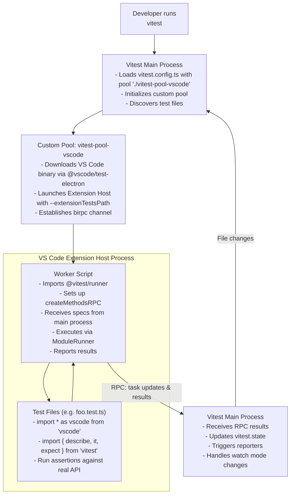

# vitest-environment-vscode Design Document

## Executive Summary

This project creates a custom Vitest environment that enables VS Code extension developers to run tests inside an actual VS Code Extension Host instance, providing full access to the VS Code API without requiring extensive mocking.

## Problem Statement

### Current Pain Points

1. **Extensive Mocking Required**: Testing VS Code extensions traditionally requires mocking the entire VS Code API surface area, which is:
   - Time-consuming to set up and maintain
   - Prone to divergence from actual VS Code behavior
   - Often incomplete, missing edge cases and subtle behavioral nuances

2. **Limited Integration Testing**: Current approaches using `@vscode/test-electron` require:
   - Separate test infrastructure from unit tests
   - Different test runner (Mocha by default)
   - Complex setup with `runTests` API
   - Cannot leverage Vitest's modern features (snapshots, watch mode, parallel execution, etc.)

3. **Developer Experience**: Extension developers want:
   - A unified testing approach across unit and integration tests
   - Modern testing features (Vitest's DX, speed, and tooling)
   - Ability to test against real VS Code API behavior
   - Fast feedback loops during development

## Solution Overview

Create a Vitest custom pool (`vitest-pool-vscode`) that:

1. **Launches VS Code Extension Host** - Uses `@vscode/test-electron` to spawn a VS Code instance
2. **Runs Tests Inside VS Code** - Test code executes directly in the Extension Host process, no proxying needed
3. **Leverages Vitest's RPC Architecture** - Uses Vitest's existing client-server communication via `createMethodsRPC`
4. **Manages Lifecycle** - Handles setup/teardown of VS Code instances and worker processes efficiently

**Key Architectural Shift**: Tests run **inside** the VS Code Extension Host, not in Node.js with a proxy. This means:
- Direct access to the real `vscode` module
- No IPC overhead for API calls
- No complex serialization/deserialization
- True integration testing environment

## Architecture

### High-Level Flow



### Key Components

#### 1. Pool Entry Point (`src/pool.ts`)

Implements Vitest's `ProcessPool` interface:

```typescript
import type { ProcessPool, TestSpecification } from 'vitest/node'
import type { Vitest } from 'vitest/node'

export default function VitestVSCodePool(vitest: Vitest): ProcessPool {
  return {
    name: 'vscode',
    
    async runTests(specs: TestSpecification[], invalidates?: string[]) {
      // Launch VS Code instances and run tests
    },
    
    async collectTests(specs: TestSpecification[], invalidates?: string[]) {
      // Launch VS Code and collect test structure
    },
    
    async close() {
      // Cleanup VS Code instances
    }
  }
}
```

#### 2. VS Code Process Manager (`src/vscode-process-manager.ts`)

Manages VS Code instances as worker processes:
- Downloads/locates VS Code binary using `@vscode/test-electron`
- Spawns Extension Host with worker script as `--extensionTestsPath`
- Manages pool of VS Code instances for parallel execution
- Handles instance reuse and cleanup

```typescript
class VSCodeProcessManager {
  async createWorker(options: WorkerOptions): Promise<VSCodeWorker>
  async closeWorker(worker: VSCodeWorker): Promise<void>
  async getWorker(): Promise<VSCodeWorker> // from pool
}
```

#### 3. Worker Script (`src/worker.ts`)

Runs inside VS Code Extension Host:
- Exports the `run` entrypoint expected by `--extensionTestsPath`
- Imports `@vitest/runner` to execute tests
- Establishes a Unix domain socket connection (path passed via `VITEST_VSCODE_SOCKET`) back to the Vitest main process
- Integrates with Vitest's `createMethodsRPC` surface via a socket-backed `birpc` transport
- Imports and executes test files using Vitest's injected `ModuleRunner`
- Reports task updates back to the main process via the shared RPC channel

```typescript
// This file runs INSIDE the VS Code Extension Host
import net from 'node:net'
import { startTests } from '@vitest/runner'
import { createBirpc } from 'birpc'
import type { WorkerRPC, VitestRPC } from './shared-rpc-types'
import type { VitestTestRunner } from 'vitest/runners'
import type { RemoteProjectState } from './shared-rpc-types'

// vscode module is available here natively!
import * as vscode from 'vscode'

let runner: VitestTestRunner

export async function run(): Promise<void> {
  const socketPath = process.env.VITEST_VSCODE_SOCKET
  if (!socketPath) throw new Error('Missing VITEST_VSCODE_SOCKET')

  const transport = net.createConnection(socketPath)
  transport.setKeepAlive(true)

  const vitest = createBirpc<WorkerRPC, VitestRPC>(
    {
      async runTests(specs) {
        await startTests(specs, runner)
      },
      async collectTests(specs) {
        await startTests(specs, runner, { mode: 'collect-only' })
      },
      ping: () => 'pong',
      async shutdown() {
        transport.end()
      },
    },
    {
      post: msg => transport.write(JSON.stringify(msg) + '\n'),
      on: fn => {
        let buffer = ''
        transport.on('data', chunk => {
          buffer += chunk.toString()
          const frames = buffer.split('\n')
          buffer = frames.pop() ?? ''
          for (const frame of frames) {
            if (frame.length === 0) continue
            fn(JSON.parse(frame))
          }
        })
      },
      teardown: () => transport.destroy(),
    }
  )

  const project = await vitest.handshake()
  bootstrapRunnerWithProject(project)
}

function bootstrapRunnerWithProject(project: RemoteProjectState) {
  // createVsCodeRunner wires ModuleRunner + workspace hooks for VS Code
  runner = createVsCodeRunner(project)
}
```

`createVsCodeRunner` lives alongside the worker and instantiates a `VitestTestRunner` using metadata returned during the handshake (module graph, snapshot manager, config). It keeps the ModuleRunner wired to the main process so Vite can continue serving transformed source and assets.

#### 4. RPC Bridge (`src/rpc.ts`)

Handles bidirectional communication:
- Uses `birpc` for type-safe RPC between main process and Extension Host
- Leverages Vitest's `createMethodsRPC` for standard test communication
- Uses process-specific Unix sockets under `/tmp/<vitest pid>` with strict permissions
- Performs handshake / keepalive so pool manager can detect hung Extension Hosts
- Handles serialization via `flatted` for complex objects

```typescript
class RPCBridge {
  createMainProcessRPC(worker: VSCodeWorker): BirpcReturn
  createWorkerRPC(): BirpcReturn // called in worker
}
```

#### 5. Runner Integration (`src/runner.ts`)

Optional custom runner for VS Code-specific features:
- Extends `VitestTestRunner` from `vitest/runners`
- Handles workspace setup/teardown between tests
- Provides VS Code-specific context to tests
- Manages Extension Host state
- Delegates module transforms and asset fetching back to the Vitest main process

## Technical Approach

### Pool Lifecycle

1. **Initialization** (called by Vitest once)
   ```typescript
   export default function VitestVSCodePool(vitest: Vitest): ProcessPool {
     const processManager = new VSCodeProcessManager({
       vscodeVersion: vitest.config.poolOptions?.vscode?.version || 'stable',
       extensionDevelopmentPath: vitest.config.root,
     })
     
     return {
       name: 'vscode',
       
       async runTests(specs: TestSpecification[], invalidates?: string[]) {
         // Get a worker from the pool (or create new one)
         const worker = await processManager.getWorker()
         
         // Setup RPC bridge
         const rpc = createRPCBridge(worker)
         
         // Tell worker to run these test files
         await rpc.runTests(specs)
         
         // Worker reports results via vitest.state.updateTasks()
       },
       
       async close() {
         await processManager.closeAll()
       }
     }
   }
   ```

2. **Worker (Extension Host) Execution**
   ```typescript
   // worker.ts - runs INSIDE VS Code Extension Host
   import net from 'node:net'
   import { startTests } from '@vitest/runner'
   import { createBirpc } from 'birpc'
   import type { WorkerRPC, VitestRPC } from './shared-rpc-types'
   
   const socket = net.createConnection(process.env.VITEST_VSCODE_SOCKET!)
   let buffer = ''
   const vitest = createBirpc<WorkerRPC, VitestRPC>(
     {
       async runTests(specs) {
         await startTests(specs, runner)
       },
       async collectTests(specs) {
         await startTests(specs, runner, { mode: 'collect-only' })
       },
       ping: () => 'pong',
     },
     {
       post: msg => socket.write(JSON.stringify(msg) + '\n'),
       on: fn => socket.on('data', chunk => dispatchChunk(chunk, fn)),
       teardown: () => socket.destroy(),
     }
   )
   
   const project = await vitest.handshake()
   bootstrapRunnerWithProject(project)
   ```
   ```typescript
   function dispatchChunk(chunk: Buffer, emit: (data: unknown) => void) {
     buffer += chunk.toString()
     const frames = buffer.split('\n')
     buffer = frames.pop() ?? ''
     for (const frame of frames) {
       if (frame) emit(JSON.parse(frame))
     }
   }
   ```

3. **Test Execution**
   - Test files are imported inside Extension Host
   - `vscode` module is natively available (no mocking!)
   - ModuleRunner requests transforms/assets from the Vitest main process over the socket
   - Tests run with full access to VS Code API
   - Results reported back to main process via RPC

4. **Cleanup**
   - Extension Host processes terminated gracefully
   - Temporary workspaces cleaned up
   - Connection pools closed

### Configuration Options

Users can configure the pool via `poolOptions`:

```typescript
// vitest.config.ts
export default defineConfig({
  test: {
    // Use the custom pool
    pool: './node_modules/vitest-pool-vscode',
    
    // Or using a published package
    // pool: 'vitest-pool-vscode',
    
    poolOptions: {
      vscode: {
        // Version of VS Code to test against
        version: 'stable' | 'insiders' | '1.85.0',
        
        // Path to extension being developed
        extensionDevelopmentPath: process.cwd(),
        
        // Workspace to open (optional)
        workspaceFolder: './test-workspace',
        
        // Additional VS Code CLI args
        launchArgs: ['--disable-extensions'],
        
        // Number of VS Code instances to run in parallel
        poolSize: 1, // Default: 1 (more = faster but more resources)
        
        // Reuse VS Code instance across test files
        reusableInstance: true,
        
        // Timeout for VS Code startup
        launchTimeout: 30000,
      }
    }
  }
})
```

### RPC Communication Design

Using Vitest's built-in RPC architecture simplifies communication significantly:

**Main Process → Worker (Extension Host):**
```typescript
// Pool tells worker to run tests
await rpc.runTests(testSpecs)
await rpc.collectTests(testSpecs)
```

**Worker → Main Process:**
```typescript
// Worker reports test progress using Vitest's standard methods
await vitest.onCollected(files)
await vitest.onTaskUpdate(tasks)
const failures = await vitest.getCountOfFailedTests()
// etc.
```

**Transport Layer:**
- Use `birpc` (Vitest's RPC library)
- Transport: per-worker Unix domain sockets under `/tmp/vitest-vscode/<pid>/<worker>`
- Initial handshake shares the Vitest project Graph + ModuleRunner wiring
- Serialization: `flatted` for handling circular references
- Type-safe with TypeScript

**Key Advantage**: No custom protocol needed - leverage Vitest's existing, battle-tested RPC infrastructure!

### Performance Optimizations

1. **Instance Pooling**
   - Maintain pool of VS Code instances (configurable size)
   - Reuse instances across test files
   - Balance between speed and isolation

2. **Parallel Execution**
   - Multiple VS Code instances for parallel test files
   - Configurable `poolSize` option
   - Smart scheduling to maximize throughput

3. **Fast Startup**
   - Pre-warm VS Code instances during initialization
   - Cache downloaded VS Code binaries
   - Minimal workspace setup

4. **Efficient Teardown**
   - Graceful shutdown with timeout
   - Clean workspace state between tests (faster than full restart)
   - Background cleanup of temp directories

## Technical Challenges & Solutions

### Challenge 1: Running Tests Inside Extension Host

**Problem**: Vitest expects to run in Node.js, but we need to run inside VS Code Extension Host.

**Solution**: 
- Use Vitest's pool API which is designed for custom execution environments
- Import `@vitest/runner` inside the Extension Host worker
- Leverage `startTests` function that handles test collection and execution
- Use `ModuleRunner` to import test files while delegating transforms to the Vitest main process

### Challenge 2: Communication Between Processes

**Problem**: Main Vitest process needs to communicate with Extension Host workers.

**Solution**:
- Use `createMethodsRPC` from Vitest for standard test communication
- Use `birpc` for bidirectional RPC (same stack Vitest uses internally)
- Transport over scoped Unix domain sockets created per worker
- Handshake shares Vitest project metadata and establishes keepalive heartbeats
- Leverage Vitest's existing patterns - no reinventing the wheel

### Challenge 3: Test Isolation

**Problem**: VS Code maintains state between tests.

**Solution**:
- Reset workspace between test files
- Clear extension state via commands
- Option to use separate instances for complete isolation (via pool)
- Custom runner hooks for cleanup

### Challenge 4: Parallel Execution

**Problem**: Running tests in parallel requires multiple VS Code instances.

**Solution**:
- Implement process pool pattern
- Configurable pool size based on available resources
- Smart worker allocation and reuse
- Health checks and automatic instance recovery

### Challenge 5: Debugging Experience

**Problem**: Tests run in separate process from main Vitest.

**Solution**:
- Document VS Code's built-in debugging for Extension Host
- Provide debug mode that keeps VS Code window open
- Source map support for TypeScript
- Integration with VS Code's test runner UI (future)

## Usage Examples

### Basic Test

```typescript
// test/commands.test.ts
import { describe, it, expect } from 'vitest'
import * as vscode from 'vscode' // Real VS Code API!

describe('Extension Commands', () => {
  it('should register hello command', async () => {
    const commands = await vscode.commands.getCommands()
    expect(commands).toContain('extension.helloWorld')
  })
  
  it('should show message when command executed', async () => {
    // This actually runs in VS Code Extension Host
    // No mocking needed!
    await vscode.commands.executeCommand('extension.helloWorld')
    // Can test real behavior
  })
})
```

### Testing with Workspace

```typescript
// test/editor.test.ts
import { describe, it, expect, beforeEach } from 'vitest'
import * as vscode from 'vscode'
import * as path from 'path'

describe('Editor Integration', () => {
  beforeEach(async () => {
    // Close all editors - real VS Code state management
    await vscode.commands.executeCommand('workbench.action.closeAllEditors')
  })
  
  it('should format document', async () => {
    const uri = vscode.Uri.file(
      path.join(__dirname, 'fixtures', 'test.ts')
    )
    
    // Real VS Code document API
    const doc = await vscode.workspace.openTextDocument(uri)
    const editor = await vscode.window.showTextDocument(doc)
    
    // Real formatting command
    await vscode.commands.executeCommand('editor.action.formatDocument')
    
    // Test against actual formatted content
    expect(doc.getText()).toMatchSnapshot()
  })
})
```

### Configuration

```typescript
// vitest.config.ts
import { defineConfig } from 'vitest/config'

export default defineConfig({
  test: {
    // Use the custom pool
    pool: 'vitest-pool-vscode',
    
    poolOptions: {
      vscode: {
        version: 'stable',
        extensionDevelopmentPath: process.cwd(),
        workspaceFolder: './test-workspace',
        launchArgs: [
          '--disable-extensions',  // Disable other extensions
        ],
        poolSize: 2, // Run 2 VS Code instances in parallel
      }
    },
    
    // Standard Vitest options work!
    include: ['test/**/*.test.ts'],
    coverage: {
      provider: 'v8',
      reporter: ['text', 'html']
    }
  }
})
```

## Dependencies

### Runtime
- `@vscode/test-electron` - VS Code instance management and launching
- `@vitest/runner` - Test execution inside Extension Host
- `birpc` - RPC communication (same as Vitest uses)
- `flatted` - Serialization for RPC messages
- `vitest` - Peer dependency

### Development
- `@types/vscode` - TypeScript definitions for VS Code API
- `@types/node` - Node.js types
- TypeScript, ESLint, Prettier (already configured)

## Open Questions

1. **Instance Management Strategy**: Single shared instance vs. per-file instances? (Impacts speed vs isolation)
2. **TypeScript Support**: Should we transpile tests or require pre-compilation?
3. **Watch Mode**: How to handle file changes efficiently with long-lived VS Code process?
4. **Coverage**: Can we collect coverage from Extension Host?
5. **API Compatibility**: How to handle VS Code API version differences?

## Risks & Mitigations

| Risk | Impact | Likelihood | Mitigation |
|------|--------|------------|------------|
| IPC performance bottleneck | High | Medium | Implement batching, caching, optimize protocol |
| VS Code API changes break proxy | High | Low | Pin to stable API, version detection, graceful degradation |
| Complex setup deters adoption | Medium | Medium | Excellent documentation, migration guides, examples |
| Debugging difficulty | Medium | High | Debug mode, verbose logging, clear error messages |
| CI/CD environment issues | High | Medium | Xvfb support, headless mode, detailed CI docs |

## Conclusion

`vitest-pool-vscode` (previously conceptualized as an environment) leverages Vitest's pool architecture to run tests **directly inside VS Code Extension Host**. This approach:

- **Eliminates API proxying** - Tests run where `vscode` module exists natively
- **Leverages Vitest's infrastructure** - Uses `createMethodsRPC`, `birpc`, and standard patterns
- **Provides true integration testing** - Real VS Code API, real behavior, no mocking
- **Maintains excellent DX** - All Vitest features work (watch, snapshots, coverage, etc.)
- **Scales efficiently** - Process pool pattern enables parallel execution

The key insight is using Vitest's **pool API** instead of environment API, running tests in VS Code's process space rather than proxying from Node.js. This is cleaner, faster, and more reliable.

The phased approach that supports this design now lives in `docs/roadmap.md`, ensuring delivery tracking stays focused while this document concentrates on architecture. Together they chart a path that scales to the full complexity of real-world VS Code extension testing.
