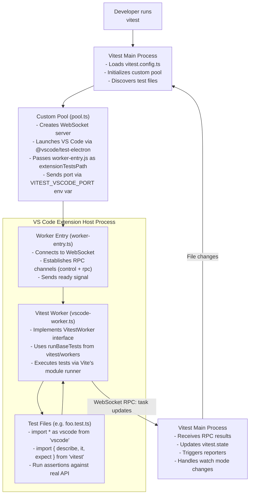

# vitest-environment-vscode Design Document

## Executive Summary

This project creates a custom Vitest environment that enables VS Code extension developers to run tests inside an actual VS Code Extension Host instance, providing full access to the VS Code API without requiring extensive mocking.

## Problem Statement

### Current Pain Points

1. **Extensive Mocking Required**: Testing VS Code extensions traditionally requires mocking the entire VS Code API surface area, which is:
    - Time-consuming to set up and maintain
    - Prone to divergence from actual VS Code behavior
    - Often incomplete, missing edge cases and subtle behavioral nuances

2. **Limited Integration Testing**: Current approaches using `@vscode/test-electron` require:
    - Separate test infrastructure from unit tests
    - Different test runner (Mocha by default)
    - Complex setup with `runTests` API
    - Cannot leverage Vitest's modern features (snapshots, watch mode, parallel execution, etc.)

3. **Developer Experience**: Extension developers want:
    - A unified testing approach across unit and integration tests
    - Modern testing features (Vitest's DX, speed, and tooling)
    - Ability to test against real VS Code API behavior
    - Fast feedback loops during development

## Solution Overview

Create a Vitest custom pool (`vitest-environment-vscode`) that:

1. **Launches VS Code Extension Host** - Uses `@vscode/test-electron` to spawn a VS Code instance
2. **Runs Tests Inside VS Code** - Test code executes directly in the Extension Host process
3. **WebSocket-Based Communication** - Uses WebSocket for RPC between pool and Extension Host worker
4. **Leverages Vitest's Worker Architecture** - Uses `vitest/workers` for test execution

**Key Architectural Principles**:

- Tests run **inside** the VS Code Extension Host, not in Node.js
- Direct access to the real `vscode` module (externalized in Vite config)
- Simple WebSocket-based RPC for pool-worker communication
- Vitest's `runBaseTests` handles test execution inside the worker

## Architecture

### High-Level Flow



### Key Components

#### 1. Pool Entry Point (`src/pool.ts`)

Implements Vitest's `ProcessPool` interface:

```typescript
import type { ProcessPool, TestSpecification } from 'vitest/node';
import type { Vitest } from 'vitest/node';
import { WebSocketServer } from 'ws';
import { runTests as launchVsCodeTests } from '@vscode/test-electron';

export default function VitestVSCodePool(ctx: Vitest): ProcessPool {
	const server = new WebSocketServer({ host: '127.0.0.1', port: 0 });
	const port = (server.address() as any).port;

	return {
		name: 'vscode',

		async runTests(specs: TestSpecification[], invalidates?: string[]) {
			// Launch VS Code with worker-entry.js as extensionTestsPath
			// Pass WebSocket port via VITEST_VSCODE_PORT env var
			await launchVsCodeTests({
				extensionDevelopmentPath,
				extensionTestsPath: workerEntryPath,
				launchArgs: ['--disable-extensions'],
				extensionTestsEnv: { VITEST_VSCODE_PORT: port },
			});
		},

		async collectTests(specs: TestSpecification[], invalidates?: string[]) {
			// Similar to runTests but with collect mode
		},

		async close() {
			// Close WebSocket server and cleanup
			server.close();
		},
	};
}
```

#### 2. Worker Entry Point (`src/worker-entry.ts`)

Runs inside VS Code Extension Host when loaded via `--extensionTestsPath`:

- Connects to WebSocket server using port from `VITEST_VSCODE_PORT` env var
- Establishes two communication channels: `control` (for commands) and `rpc` (for Vitest worker RPC)
- Sends ready signal to pool
- Handles control requests (run, collect, shutdown)
- Delegates to `vscode-worker.ts` for actual test execution

```typescript
// Simplified excerpt
const port = process.env.VITEST_VSCODE_PORT;
const socket = new WebSocket(`ws://127.0.0.1:${port}`);

socket.on('message', (data: RawData) => {
	const envelope = decodeEnvelope(data);
	if (envelope.channel === CONTROL_CHANNEL) {
		handleControlRequest(envelope.payload);
	} else if (envelope.channel === RPC_CHANNEL) {
		handleRpcMessage(envelope.payload);
	}
});

// Send ready signal
socket.send(encodeEnvelope(CONTROL_CHANNEL, { type: 'ready' }));
```

#### 3. Vitest Worker (`src/vscode-worker.ts`)\n\nImplements the `VitestWorker` interface from `vitest/workers`:\n\n```typescript\nimport { parse, stringify } from 'flatted';\nimport { runBaseTests, type VitestWorker } from 'vitest/workers';\nimport { getTransport } from './worker-transport';\n\nconst worker: VitestWorker = {\n\tgetRpcOptions() {\n\t\tconst transport = getTransport();\n\t\treturn {\n\t\t\tpost: (data) => transport.post(data),\n\t\t\ton: (fn) => transport.subscribe(fn),\n\t\t\tserialize: stringify,\n\t\t\tdeserialize: parse,\n\t\t};\n\t},\n\trunTests: (state) => runBaseTests('run', state),\n\tcollectTests: (state) => runBaseTests('collect', state),\n};\n\nexport default worker;\n```

#### 4. IPC Layer (`src/ipc.ts`)\n\nDefines message envelope structure for WebSocket communication:\n\n- Two channels: `CONTROL_CHANNEL` (for pool-worker commands) and `RPC_CHANNEL` (for Vitest RPC)\n- Message envelope: `{ channel: string, payload: unknown }`\n- Control messages: `ready`, `run`, `collect`, `shutdown`
- Uses `flatted` for serialization to handle circular references

```typescript
// This file runs INSIDE the VS Code Extension Host
import net from 'node:net';
import { startTests } from '@vitest/runner';
import { createBirpc } from 'birpc';
import type { WorkerRPC, VitestRPC } from './shared-rpc-types';
import type { VitestTestRunner } from 'vitest/runners';
import type { RemoteProjectState } from './shared-rpc-types';

// vscode module is available here natively!
import * as vscode from 'vscode';

let runner: VitestTestRunner;

export async function run(): Promise<void> {
	const socketPath = process.env.VITEST_VSCODE_SOCKET;
	if (!socketPath) throw new Error('Missing VITEST_VSCODE_SOCKET');

	const transport = net.createConnection(socketPath);
	transport.setKeepAlive(true);

	const vitest = createBirpc<WorkerRPC, VitestRPC>(
		{
			async runTests(specs) {
				await startTests(specs, runner);
			},
			async collectTests(specs) {
				await startTests(specs, runner, { mode: 'collect-only' });
			},
			ping: () => 'pong',
			async shutdown() {
				transport.end();
			},
		},
		{
			post: (msg) => transport.write(JSON.stringify(msg) + '\n'),
			on: (fn) => {
				let buffer = '';
				transport.on('data', (chunk) => {
					buffer += chunk.toString();
					const frames = buffer.split('\n');
					buffer = frames.pop() ?? '';
					for (const frame of frames) {
						if (frame.length === 0) continue;
						fn(JSON.parse(frame));
					}
				});
			},
			teardown: () => transport.destroy(),
		}
	);

	const project = await vitest.handshake();
	bootstrapRunnerWithProject(project);
}

function bootstrapRunnerWithProject(project: RemoteProjectState) {
	// createVsCodeRunner wires ModuleRunner + workspace hooks for VS Code
	runner = createVsCodeRunner(project);
}
```

#### 4. IPC Layer (`src/ipc.ts`)\n\nDefines message envelope structure for WebSocket communication:\n\n- Two channels: `CONTROL_CHANNEL` (for pool-worker commands) and `RPC_CHANNEL` (for Vitest RPC)\n- Message envelope: `{ channel: string, payload: unknown }`\n- Control messages: `ready`, `run`, `collect`, `shutdown`\n- Uses `flatted` for serialization to handle circular references\n\n#### 5. Worker Transport (`src/worker-transport.ts`)\n\nManages the RPC transport layer for the worker:\n\n- Provides singleton access to the WebSocket connection established by `worker-entry.ts`\n- Implements subscribe/post interface for Vitest's RPC system\n- Filters RPC channel messages from control channel messages\n\n## Technical Approach\n\n### Pool Lifecycle\n\n1. **Initialization**\n\t- Pool creates WebSocket server on localhost with random port\n\t- Server waits for worker connection\n\n2. **VS Code Launch**\n\t- Pool calls `@vscode/test-electron`'s `runTests()`\n\t- Passes `worker-entry.js` as `extensionTestsPath`\n\t- Passes WebSocket port via `VITEST_VSCODE_PORT` environment variable\n\n3. **Worker Connection**\n\t- Worker entry connects to WebSocket server\n\t- Sends ready signal on control channel\n\t- Pool waits for ready before dispatching tests\n\n4. **Test Execution**\n\t- Pool sends `run` or `collect` control request\n\t- Worker calls `runBaseTests()` with serialized context\n\t- Vitest's module runner loads test files\n\t- `vscode` module is externalized and loaded natively by VS Code\n\t- Test results stream back via RPC channel\n\n5. **Cleanup**\n\t- Pool sends `shutdown` control request\n\t- Worker closes WebSocket connection\n\t- VS Code Extension Host process exits\n\t- Pool closes WebSocket server

#### 4. RPC Bridge (`src/rpc.ts`)

Handles bidirectional communication:

- Uses `birpc` for type-safe RPC between main process and Extension Host
- Leverages Vitest's `createMethodsRPC` for standard test communication
- Uses process-specific Unix sockets under `/tmp/<vitest pid>` with strict permissions
- Performs handshake / keepalive so pool manager can detect hung Extension Hosts
- Handles serialization via `flatted` for complex objects

```typescript
class RPCBridge {
	createMainProcessRPC(worker: VSCodeWorker): BirpcReturn;
	createWorkerRPC(): BirpcReturn; // called in worker
}
```

#### 5. Runner Integration (`src/runner.ts`)

Optional custom runner for VS Code-specific features:

- Extends `VitestTestRunner` from `vitest/runners`
- Handles workspace setup/teardown between tests
- Provides VS Code-specific context to tests
- Manages Extension Host state
- Delegates module transforms and asset fetching back to the Vitest main process

## Technical Approach

### Pool Lifecycle

1. **Initialization** (called by Vitest once)

    ```typescript
    export default function VitestVSCodePool(vitest: Vitest): ProcessPool {
    	const processManager = new VSCodeProcessManager({
    		vscodeVersion: vitest.config.poolOptions?.vscode?.version || 'stable',
    		extensionDevelopmentPath: vitest.config.root,
    	});

    	return {
    		name: 'vscode',

    		async runTests(specs: TestSpecification[], invalidates?: string[]) {
    			// Get a worker from the pool (or create new one)
    			const worker = await processManager.getWorker();

    			// Setup RPC bridge
    			const rpc = createRPCBridge(worker);

    			// Tell worker to run these test files
    			await rpc.runTests(specs);

    			// Worker reports results via vitest.state.updateTasks()
    		},

    		async close() {
    			await processManager.closeAll();
    		},
    	};
    }
    ```

2. **Worker (Extension Host) Execution**

    ```typescript
    // worker.ts - runs INSIDE VS Code Extension Host
    import net from 'node:net';
    import { startTests } from '@vitest/runner';
    import { createBirpc } from 'birpc';
    import type { WorkerRPC, VitestRPC } from './shared-rpc-types';

    const socket = net.createConnection(process.env.VITEST_VSCODE_SOCKET!);
    let buffer = '';
    const vitest = createBirpc<WorkerRPC, VitestRPC>(
    	{
    		async runTests(specs) {
    			await startTests(specs, runner);
    		},
    		async collectTests(specs) {
    			await startTests(specs, runner, { mode: 'collect-only' });
    		},
    		ping: () => 'pong',
    	},
    	{
    		post: (msg) => socket.write(JSON.stringify(msg) + '\n'),
    		on: (fn) => socket.on('data', (chunk) => dispatchChunk(chunk, fn)),
    		teardown: () => socket.destroy(),
    	}
    );

    const project = await vitest.handshake();
    bootstrapRunnerWithProject(project);
    ```

    ```typescript
    function dispatchChunk(chunk: Buffer, emit: (data: unknown) => void) {
    	buffer += chunk.toString();
    	const frames = buffer.split('\n');
    	buffer = frames.pop() ?? '';
    	for (const frame of frames) {
    		if (frame) emit(JSON.parse(frame));
    	}
    }
### Configuration Options

Users configure the pool via Vite config:\n\n```typescript
// vite.config.ts or vitest.config.ts
import { defineConfig } from 'vitest/config';

export default defineConfig({
\ttest: {
\t\t// Use the custom pool by path or package name
\t\tpool: import.meta.resolve('vitest-environment-vscode/pool'),
\t\t// or: pool: 'vitest-environment-vscode',

\t\tpoolOptions: {
\t\t\t'vitest-environment-vscode': {
\t\t\t\t// Path to extension being developed
\t\t\t\textensionPath: import.meta.dirname,

\t\t\t\t// Workspace to open (optional)
\t\t\t\tworkspace: './test-workspace',

\t\t\t\t// VS Code version (optional, defaults to 'stable')
\t\t\t\tvscodeVersion: 'stable' | 'insiders' | '1.95.0',

\t\t\t\t// Additional VS Code CLI args (optional)
\t\t\t\tlaunchArgs: ['--disable-extensions'],
\t\t\t},
\t\t},

\t\t// Configure Vite to externalize vscode module
\t\tserver: {
\t\t\tdeps: {
\t\t\t\texternal: [/^vscode$/],
\t\t\t},
\t\t},
\t},
});
```

**Critical**: The `vscode` module must be externalized in Vite's config so it's loaded natively by VS Code's module system rather than transformed by Vite.

### Communication Architecture

The pool uses a simple WebSocket-based RPC system with two channels:

**1. Control Channel** - Pool-to-worker commands:
- `ready` - Worker signals it's connected and ready
- `run` - Execute tests with provided specs
- `collect` - Collect test structure without running
- `shutdown` - Gracefully close worker

**2. RPC Channel** - Vitest's worker RPC:
- Uses `birpc` for bidirectional communication
- `runTests(state)` and `collectTests(state)` from main process
- Task updates flow back to Vitest's state manager
- Serialized with `flatted` to handle circular references

**Transport**: WebSocket over localhost with ephemeral port passed via environment variable.

### Performance Characteristics

1. **Startup Time**
    - First test run: ~2-3s (VS Code download + launch)
    - Subsequent runs: ~1-2s (using cached VS Code binary)
    - Tests execute at native speed inside Extension Host

2. **Limitations**
    - Currently single VS Code instance (no parallelization)
    - Tests run serially within the Extension Host
    - Full VS Code launch overhead per test session

3. **Future Optimizations**
    - Instance pooling for parallel test files
    - Worker reuse across test runs in watch mode
    - Faster startup with pre-warmed instances

## Technical Challenges & Solutions

### Challenge 1: Running Tests Inside Extension Host

**Problem**: Vitest expects to run in Node.js, but we need access to VS Code's `vscode` module.

**Solution**:
- Use Vitest's pool API to launch custom execution environment
- Use `@vscode/test-electron` to spawn VS Code with worker as `extensionTestsPath`
- Import `vitest/workers` in the Extension Host to execute tests
- **Critical**: Externalize `vscode` module in Vite config so it's loaded natively by VS Code

### Challenge 2: Communication Between Processes

**Problem**: Main Vitest process needs to communicate with Extension Host worker.

**Solution**:
- WebSocket server in pool with ephemeral port
- Worker connects on startup using port from environment variable
- Two-channel system: control (commands) + rpc (Vitest worker protocol)
- Uses `birpc` and `flatted` for type-safe serialization

### Challenge 3: Module Resolution

**Problem**: Vite's module runner tries to transform/bundle the `vscode` module, which doesn't exist as a file.

**Solution**:
- Configure `server.deps.external: [/^vscode$/]` in Vite config
- This tells Vite to skip the `vscode` module and let Node's native loader handle it
- VS Code Extension Host provides the module natively at runtime

### Challenge 4: Worker Entry Point

**Problem**: VS Code's `--extensionTestsPath` expects a specific entry point signature.

**Solution**:
- `worker-entry.ts` exports required signature
- Establishes WebSocket connection before loading worker
- Sets up transport singleton that `vscode-worker.ts` accesses
- Handles both control and RPC channels on same connection

## Usage Examples

### Basic Test

```typescript
// test/commands.test.ts
import { describe, it, expect } from 'vitest';
import * as vscode from 'vscode'; // Real VS Code API!

describe('Extension Commands', () => {
	it('should register hello command', async () => {
		const commands = await vscode.commands.getCommands();
		expect(commands).toContain('extension.helloWorld');
	});

	it('should show message when command executed', async () => {
		// This actually runs in VS Code Extension Host
		// No mocking needed!
		await vscode.commands.executeCommand('extension.helloWorld');
		// Can test real behavior
	});
});
```

### Testing with Workspace

```typescript
// test/editor.test.ts
import { describe, it, expect, beforeEach } from 'vitest';
import * as vscode from 'vscode';
import * as path from 'path';

describe('Editor Integration', () => {
	beforeEach(async () => {
		// Close all editors - real VS Code state management
		await vscode.commands.executeCommand('workbench.action.closeAllEditors');
	});

	it('should format document', async () => {
		const uri = vscode.Uri.file(path.join(__dirname, 'fixtures', 'test.ts'));

		// Real VS Code document API
		const doc = await vscode.workspace.openTextDocument(uri);
		const editor = await vscode.window.showTextDocument(doc);

		// Real formatting command
		await vscode.commands.executeCommand('editor.action.formatDocument');

		// Test against actual formatted content
		expect(doc.getText()).toMatchSnapshot();
	});
});
```

### Configuration

```typescript
### Configuration

```typescript
// vite.config.ts
import { defineConfig } from 'vitest/config';

export default defineConfig({
\ttest: {
\t\tpool: import.meta.resolve('vitest-environment-vscode/pool'),
\t\tinclude: ['tests/**/*.{test,spec}.ts'],
\t\t// CRITICAL: Externalize vscode module
\t\tserver: {
\t\t\tdeps: {
\t\t\t\texternal: [/^vscode$/],
\t\t\t},
\t\t},
\t},
});
```
```

## Dependencies

### Runtime

- `@vscode/test-electron` (^2.5.2) - VS Code instance management and launching
- `birpc` (^2.6.1) - RPC communication library
- `flatted` (via birpc) - Serialization for circular references
- `ws` (^8.18.3) - WebSocket server and client
- `vitest` (>=3.2.4) - Peer dependency

### Development

- `@types/vscode` (^1.105.0) - TypeScript definitions for VS Code API
- `@types/node` (^24.8.1) - Node.js types
- `@types/ws` (^8) - WebSocket types
- TypeScript, Vite, ESLint (project-wide)

## Open Questions

1. **Watch Mode**: How to efficiently reuse VS Code instance across test runs?
2. **Parallel Execution**: Should we support multiple VS Code instances for parallel test files?
3. **Coverage**: Can we collect coverage from code running in Extension Host?
4. **Debugging**: How to streamline the debugging experience for tests?
5. **Performance**: What optimizations can reduce startup time?

## Risks & Mitigations

| Risk                               | Impact | Likelihood | Mitigation                                      |
| ---------------------------------- | ------ | ---------- | ----------------------------------------------- |
| VS Code startup time slows tests  | Medium | High       | Cache binaries, optimize launch args            |
| WebSocket communication overhead   | Low    | Low        | Local-only, minimal serialization               |
| Module resolution complexity       | High   | Medium     | Document vscode externalization requirement     |
| Debugging difficulty               | Medium | Medium     | Improve error messages, document debug workflow |
| CI/CD environment compatibility    | High   | Medium     | Test on common CI platforms, document setup     |

## Status

**Current State**: ✅ **Working MVP**

- Pool launches VS Code and establishes WebSocket connection
- Tests execute inside Extension Host with real `vscode` module access
- RPC communication working for test results
- Basic example extension tests passing

**Proven Capabilities**:
- ✅ Real VS Code API access (no mocking)
- ✅ Command registration and execution
- ✅ Window API (`showInformationMessage`)
- ✅ Extension activation lifecycle

## Conclusion

`vitest-environment-vscode` provides a Vitest pool that runs tests directly inside the VS Code Extension Host. This approach:

- **Eliminates mocking** - Tests access the real `vscode` module natively
- **Leverages Vitest's architecture** - Uses `vitest/workers` and standard pool API
- **Simple communication** - WebSocket-based RPC with two channels (control + worker RPC)
- **Maintains excellent DX** - All Vitest features work (watch, snapshots, etc.)
- **Proven working** - Successfully tests real extension code with VS Code APIs

The key insight is **externalizing the `vscode` module** in Vite's config (`server.deps.external`), allowing VS Code's native module system to provide it at runtime. This eliminates the need for complex mocking or proxying.

The implementation is simpler than initially designed - no custom runners, no process pools yet, just a straightforward pool that launches VS Code, connects via WebSocket, and runs tests with real API access.
